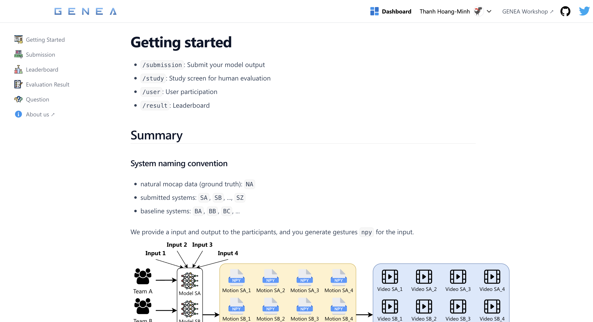

# GENEA Leaderboard Submission Page

genealeaderboard.github.io

## What is GENEA Leaderboard?

GENEA (Generation and Evaluation of Non-verbal Behaviour for Embodied Agents) Leaderboard is a leaderboard for benchmarking gesture generation models with human evaluation. The GENEA Leaderboard is the evolution of the GENEA challenge, which was held at the GENEA Workshop at ICMI 2020, 2021, 2022, 2023, and 2024.

## Why we need GENEA Leaderboard?

We standardize the input, output and evaluation process of gesture generation models with human evaluation.

How we evalution in GENEA Leaderboard?
We provide a input to teams, and each team's model will generate gestures output in .npy format.

### How we evalution in GENEA Leaderboard?

We provide a input to teams, and each team's model will generate gestures output in `.npy` format.

Then, we convert `.npy` to video `.mp4` and recruit Prolific to start user studies.
Using pairwise comparison, we evaluate the generated gestures with human evaluation

## Announcement

- The GENEA team is preparing an **online leaderboard** for benchmarking
  gesture generation models with human evaluation. This project is the evolution
  of the GENEA challenge, so stay tuned!

- If you would like to stay updated on major developments in theleaderboard project, sign up with your e-mail address [on this link](https://docs.google.com/forms/d/e/1FAIpQLSeiWKocndyCbUCBXF0vOBeX35AmiMufgX9r4oJQZ95PtHWsHg/viewform)!

## Workshop

[Workshop](https://genea-workshop.github.io/2024/workshop)  
Official GENEA Workshop at ICMI 2024

## Links to previous years

- [Results of the GENEA Challenge 2023](https://svito-zar.github.io/GENEAchallenge2023/)
- [4th GENEA Workshop website (at ICMI 2023)](https://genea-workshop.github.io/2023/)
- [Results of the GENEA Challenge 2022](https://youngwoo-yoon.github.io/GENEAchallenge2022/)
- [3rd GENEA Workshop website (at ICMI 2022)](https://genea-workshop.github.io/2022/)
- [2nd GENEA Workshop website (at ICMI 2021)](https://genea-workshop.github.io/2021/)
- [Results of the GENEA Challenge 2020](https://svito-zar.github.io/GENEAchallenge2020/)
- [1st GENEA Workshop and Challenge website (at IVA 2020)](https://genea-workshop.github.io/2020/)

## Follow us on Twitter

For updates, follow us: [GENEA Workshop](https://twitter.com/genea_workshop)
