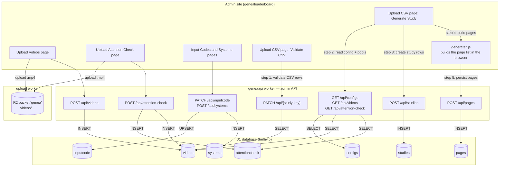

import { Steps } from "@/nextra"
import Image from "next/image"
import AllStage from "@/components/AllStage"

# Admin Home

This is the admin website for the BEAT2 Leaderboard and the 2026 GENEA Challenge.

The general workflow for running an evaluation is the following:

# 1. Set up input codes
Input codes are the list of possible file names for evaluation videos. Every submission must contain an .mp4 file for each of these file names. 

# 2. Create systems
To add a new system to the evaluation, you first need to a new entry to the `submission` database table, either through the public interface of this site, or by manually editing the database. (TODO: Make this more user friendly.)

Afterwards, you can go to the `Systems` tab and create a new system for the evaluation. Each system has its own folder for storing videos.

# 3. Upload videos
The videos are stored in a different folder for each evaluation. 

For the human-likeness user study, you only need to upload one set of videos with matched motion and audio. These are called `origin` videos in the database and in the code. 

For the speech appropriateness user study, you need to upload one mismatched video for each origin video. 

For the dyadic appropriateness user study, you need o upload both the matched and the mismatched versions. Currently,

It will be the same for semantic appropriateness. 


# 4. Upload attention check videos
Every study needs to have attention check.

# 5. Upload user-study specification
Click "Upload CSV" and upload the csv files that specify your user study -- one csv file per participant.

# Workflow: creating a user study

The diagram below shows the API calls and database writes involved. Steps **1–5**
are the actual study-creation path triggered from the **Upload CSV** page; the
calls above them are the one-time prerequisites (uploading videos, attention
checks, input codes and systems).



Once `studies` and `pages` rows exist, the study is **ready**. It is then served
to Prolific participants by the separate `api` worker: `POST /api/start-study`
claims a `new` study and marks it `started`, `GET /api/study` returns the study
with its pages and videos, and `POST /api/finish-study` records the results.

**Notes**

- The rounded cylinders are D1 tables (and the R2 bucket); rectangles are pages or API endpoints.
- `geneaapi` is the admin API worker — every `/api/*` call on this diagram hits it.
- The per-page list is assembled **client-side** by the `generate*.js` files (one per study type), then persisted in a single `POST /api/pages`.
- Attention-check upload writes **two** tables: each clip becomes a `videos` row (`type='check'`) and clips are paired up in `attentioncheck`.


#### Example csv structure for pairwise human-likeness studies

```csv
clip_name, system_1, system_2,
12_zhao_2_2_2_segment_3, SA, SB
12_zhao_2_17_17_segment_2, SC, NA
13_lu_2_13_13_segment_2, SG, BA
```

#### Example csv structure for pairwise emotion studies

```csv
clip_name, system_1, system_2, emotion
12_zhao_2_2_2_segment_3, SA, SB, anger
12_zhao_2_17_17_segment_2, SC, NA, happy
13_lu_2_13_13_segment_2, SG, BA, sad
```

#### Example csv structure for speech appropriateness studies

```csv
clip_name, system, mismatch_type, mismatch_data
12_zhao_2_2_2_segment_3, SA, speech, 13_lu_2_13_13_segment_2
12_zhao_2_17_17_segment_2, BB, speech, 13_lu_2_13_13_segment_2
13_lu_2_13_13_segment_2, NA, speech, 12_zhao_2_17_17_segment_2
```

#### Example csv structure for emotion mismatching studies

```csv
clip_name, system, mismatch_type, mismatch_data
12_zhao_2_2_2_segment_3, SA, emotion, sad
12_zhao_2_17_17_segment_2, BB, emotion, bored
13_lu_2_13_13_segment_2, NA, emotion, happy
```

Sample study screen

<Image
  src="/study_screen.png"
  alt="study_screen"
  width={0}
  height={0}
  sizes="100vw"
  style={{ width: "100%", height: "auto" }}
/>

- You can visit `/study` to get information about each study screen.
- You can visit `/user` to follow all user participation our study.

### Recruit partipation on Prolific to study

Each Prolific partipation will be study for

<Image
  src="/prolific.png"
  alt="prolific"
  width={0}
  height={0}
  sizes="100vw"
  style={{ width: "100%", height: "auto" }}
/>

**When partipation study, we record all action and final result**

**Selection Result**

<Image
  src="/selection_result.png"
  alt="selection_result"
  width={0}
  height={0}
  sizes="100vw"
  style={{ width: "80%", height: "auto" }}
/>

**Actions Record**

<Image
  src="/actions_record.png"
  alt="actions_record"
  width={0}
  height={0}
  sizes="100vw"
  style={{ width: "80%", height: "auto" }}
/>

### Evalution final result

Sample evalution result

<Image
  src="/eval_result.png"
  alt="eval_result"
  width={0}
  height={0}
  sizes="100vw"
  style={{ width: "80%", height: "auto" }}
/>

</Steps>
